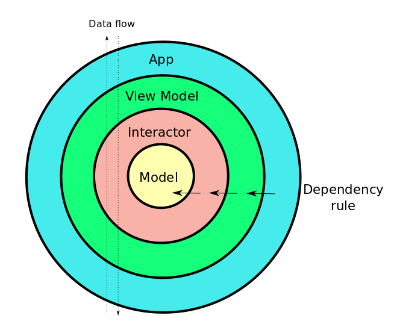

# clean-code-kodein
A simple Android app showcasing clean code architecture and Jetpack technologies. See the original tech-test document in the root folder - `Android Tech Test - New.pdf`
### Installation
You should be able to open it directly in Android Studio. I used to leave out the Gradle wrapper from my projects because Studio would have regenerated it for you when you imported it - and I didn't like polluting my top level folder with unecessary files. These Gradle files have been included here due to previous complaints.  
Once loaded you may need to `Build -> Rebuild Project` to get all of the data binding Java code generated.
### Introduction
If you google "clean code architecture" you will get plenty of hits containing onion diagrams all pretty much based on Uncle Bob's flagship:
http://blog.cleancoder.com/uncle-bob/2012/08/13/the-clean-architecture.html
  
My interpretation looks like this:

The difference between this and the other countless Android implementations is that I have enforced the Dependancy Rule using project modules. Each onion skin is its' own project module with one and only one module dependancy on the adjacent module working inwards from the outside - except the inner-most 'Model' module which has no module dependency.  
###### App
The aim is that this layer will only ever contain Activities, Fragments, the Navigation Controller and some layouts. These Activities and Fragments will be responsible for binding data with the View Model layer and for navigating between Activities and Fragments - and that's all.
###### ViewModel
This is a seperate Android layer containing ViewModels, Adapters and other specific Android view controllers. This layer loads information from the Interactor layer into the bound data elements, intercepting user input and providing control observables to the app layer.
###### Interactor
Pure-Kotlin layer responsible for collating raw data from the Model layer for use by the ViewModel. The same Interactor can be reused by different ViewModels.
###### Model
Pure-Kotlin raw data fetching layer. Retrofit lives in this layer but you could also have a Database setup here.
### Jetpack
I've used the following Jetpack elements:
- ViewModel
- Navigation Controller
- LiveData*
- Kotlin Extensions
- Data Binding
- Lifecycle Observers

I **didn't** use the following Jetpack elements:

- Paging (not enough raw data)
- Work Manager (complexity didn't require it)
- ROOM (no excuse really - the data never changes)

*It turns out that you can't use LiveData everywhere an Observable can be used. It appears that LiveData acts like a Behaviour Subject - it re-emits the last emission when an observer starts to observe it. This means that it is next to useless as a click-listener. I found that backing out from the detail view to the list view was immediately trying to go back to the detail view because the LiveData had remembered and was reimitting the last item click. Instead I used an Rx Publish Subject and extended the Observable class to clean up the Disposable with the lifecycle.
### Kodein
I used Kodein (http://kodein.org/Kodein-DI/) instead of Dagger for the dependency injection. I personally prefer this as it is simple to set up and does not require annotation processing and Java code generation.  I could also have used KOIN (https://insert-koin.io/) which is very similar.  

I realise, however, that everybody loves Dagger 2 so I am working on a Dagger version. Dagger performs all of the object mapping at the app layer which means you can't inject your Interactors directly into the ViewModel as I have done here - Dagger won't be able to access the Interactor-layer objects because there is no direct dependency between the App and Interactor layers. The workaround is to wrap the Interactor objects in a ViewModel-layer object and inject that instead.
### Testing
There are unit-tests where appropriate in the ViewModel and Interactor layers. In fact, the code in these layers was test-driven (TDD). I wasn't sure what was worth unit testing at the App layer. Most of the code here is standard Android boiler-plate with no business logic. I think that's the whole point of the excersise, though - move all of your business and application logic out of the view (app) so it can be easily tested.
### TO-DO
Error-handling!! I haven't decided the best way to do this yet - either a top-level view (like the progress bar) that's made visible, or I could do something with the Navigation Controller. Probably the former. Simpler is usually better. It's likely that I will include it with the Dagger version.  

Offline storage, probably ROOM. Once downloaded, the raw data never changes.
### Stuff I particularly like
My implementation of the item click listener in MainAdapter. It combines an Rx Publish Subject with data binding making the resulting code really flat.
### Stuff I really **don't** like
Like Dagger 2, Data Binding produces loads of auto-generated Java code. I have a number of beefs with this:
1. It's Java code.  I thought Google was trying to usher everybody into Kotlin? So much for having a pure-Kotlin project.
2. If you get it wrong you get a compilation error in the generated Java code which isn't really much help in fixing it. Dagger used to do this and still does but at least now with Dagger you get a subsequent intelligent error message - usually an injects/provides mapping and what's missing.
3. All this gernerated code is adding to the method pointer count.